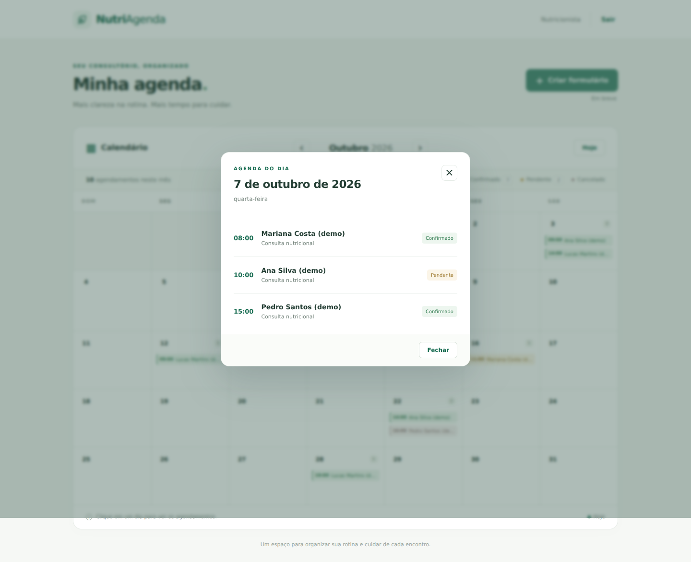

# NutriAgenda

Agenda mensal para nutricionistas, desenvolvida com **Python e Django**. A interface segue a referência do projeto: botão “Criar formulário” no topo e calendário logo abaixo.

## O que está implementado

- Calendário mensal com todos os dias, navegação entre meses e botão **Hoje**.
- Destaque do dia atual, nomes e horários de até duas consultas por dia, contador e indicação das consultas adicionais.
- Popup ao clicar em qualquer dia, mostrando **todos** os agendamentos daquele dia, em ordem de horário, com cliente e status.
- Estados de carregamento, dia vazio e erro de conexão. Fechamento pelo botão, pela tecla Esc ou pelo clique fora do popup.
- Layout responsivo, navegação por teclado e interface em português.
- Dados persistidos em SQLite e cadastro de clientes/agendamentos pelo painel administrativo do Django.
- Login e separação dos dados por nutricionista. A agenda e a API mostram somente os clientes do usuário conectado, inclusive quando ele é superusuário. No admin, superusuários podem gerenciar todos os dados.
- Botão **Criar formulário**, desativado e identificado como **Em breve**. O formulário público e o agendamento pelo cliente ainda não foram implementados.

## Rodar localmente

Requisitos: Python 3.10 ou superior e Git.

Se recebeu o projeto em ZIP, extraia-o e abra um terminal na pasta `NutriAgenda`, onde está `manage.py`. Pule o `git clone` e comece pela criação do ambiente virtual. As instruções de clonagem abaixo se aplicam depois que as alterações forem enviadas ao GitHub.

```bash
git clone https://github.com/Guelmif/NutriAgenda.git
cd NutriAgenda
python -m venv .venv
```

Ative o ambiente virtual:

```bash
# Windows (PowerShell)
.venv\Scripts\Activate.ps1

# Windows (Prompt de Comando)
.venv\Scripts\activate.bat

# Linux / macOS
source .venv/bin/activate
```

Depois execute:

```bash
python -m pip install -r requirements.txt
python manage.py migrate
python manage.py createsuperuser
python manage.py runserver
```

Se estiver usando o ZIP, copie seu conteúdo para a cópia local do repositório antes de fazer commit, mantendo a pasta `.git` original. O pacote também inclui um patch aplicável ao commit inicial `a19eef7`: na raiz da cópia original, execute `git apply --check CAMINHO/nutriagenda.patch` e depois `git apply CAMINHO/nutriagenda.patch`, em vez de copiar os arquivos.

Abra **http://127.0.0.1:8000/** e entre com o usuário criado. O painel administrativo está em **http://127.0.0.1:8000/admin/**.

### Preencher a agenda

No painel administrativo:

1. Cadastre um **Cliente** e associe-o ao usuário nutricionista que verá a consulta na agenda.
2. Cadastre um **Agendamento**, selecionando cliente, data, horário e status.
3. Volte ao calendário e abra o mês correspondente. Clique no dia para ver a consulta.

Para visualizar o mês atual com dados fictícios, pare o servidor ou abra outro terminal com o ambiente ativo e execute:

```bash
python manage.py seed_demo --usuario SEU_USUARIO
```

Substitua `SEU_USUARIO` pelo login criado. O comando adiciona dez consultas e quatro clientes identificados com `(demo)`, sem criar senhas e sem substituir registros existentes. Repeti-lo no mesmo mês não duplica os exemplos. Os clientes usam endereços `example.com`; nenhum e-mail é enviado.

### Outros nutricionistas

Crie usuários pelo admin. Para permitir que cadastrem os próprios clientes e consultas, marque **Membro da equipe** e conceda as permissões de visualizar, adicionar, alterar e excluir **Cliente** e **Agendamento**. Não é preciso torná-los superusuários. Os campos e registros do admin ficam limitados ao próprio nutricionista.

## Estrutura

```text
NutriAgenda/
├── config/                     # Configurações, URLs, ASGI e WSGI
├── agenda/
│   ├── models.py               # Cliente e Agendamento
│   ├── admin.py                # Cadastros e separação por nutricionista
│   ├── views.py                # Calendário e consulta dos agendamentos por dia
│   ├── urls.py
│   ├── migrations/
│   ├── management/commands/seed_demo.py
│   ├── templates/agenda/       # Página, login e estrutura visual
│   ├── static/agenda/          # CSS e JavaScript, sem dependências externas
│   └── tests.py
├── manage.py
└── requirements.txt
```

## Imagens da interface

As imagens usam somente dados fictícios do comando `seed_demo`.




As versões para celular estão em `docs/calendario-mobile.png` e `docs/agendamentos-mobile.png`.

## Rotas

| Método | Rota | Uso |
| --- | --- | --- |
| GET | `/` | Calendário do mês atual |
| GET | `/?ano=2026&mes=10` | Calendário de um mês específico |
| GET | `/api/agendamentos/?data=2026-10-07` | Consultas do dia, em JSON, para o popup |
| GET / POST | `/entrar/` | Login |
| POST | `/sair/` | Logout |
| GET / POST | `/admin/` | Administração do Django |

As datas aceitas estão entre 1900 e 2100. A API exige uma data no formato `AAAA-MM-DD`. O calendário é montado no servidor com o módulo `calendar` do Python. O JavaScript consulta apenas o dia selecionado e insere os nomes como texto, sem interpretar HTML. Datas e horários das consultas correspondem ao horário local do consultório; o fuso configurado é `America/Sao_Paulo`.

## Verificação

```bash
python manage.py check
python manage.py makemigrations --check --dry-run
python manage.py test
```

Os testes cobrem anos bissextos, meses com seis semanas, virada do ano, limites e datas inválidas, isolamento entre usuários, ordem das consultas, autenticação, cadastro administrativo e dados de demonstração.

## Configuração

As variáveis são lidas do ambiente do sistema; o projeto **não carrega arquivos `.env` automaticamente**.

| Variável | Padrão local | Uso |
| --- | --- | --- |
| `DJANGO_DEBUG` | `true` | Defina `false` em produção |
| `DJANGO_SECRET_KEY` | Chave local gerada em `.dev-secret-key` | Obrigatória em produção |
| `DJANGO_ALLOWED_HOSTS` | `localhost,127.0.0.1,[::1]` | Hosts separados por vírgula |

O servidor `runserver` é para desenvolvimento. A publicação não faz parte desta entrega; em produção configure HTTPS, um servidor WSGI/ASGI e o serviço de arquivos estáticos após `python manage.py collectstatic`. Com `DJANGO_DEBUG=false`, os cookies de sessão e CSRF exigem HTTPS.

## Próxima etapa

Implementar o formulário público do cliente e conectá-lo aos modelos existentes. Regras de disponibilidade, duração e prevenção de conflitos de horário pertencem a essa etapa; o cadastro administrativo atual não impede consultas no mesmo horário.
