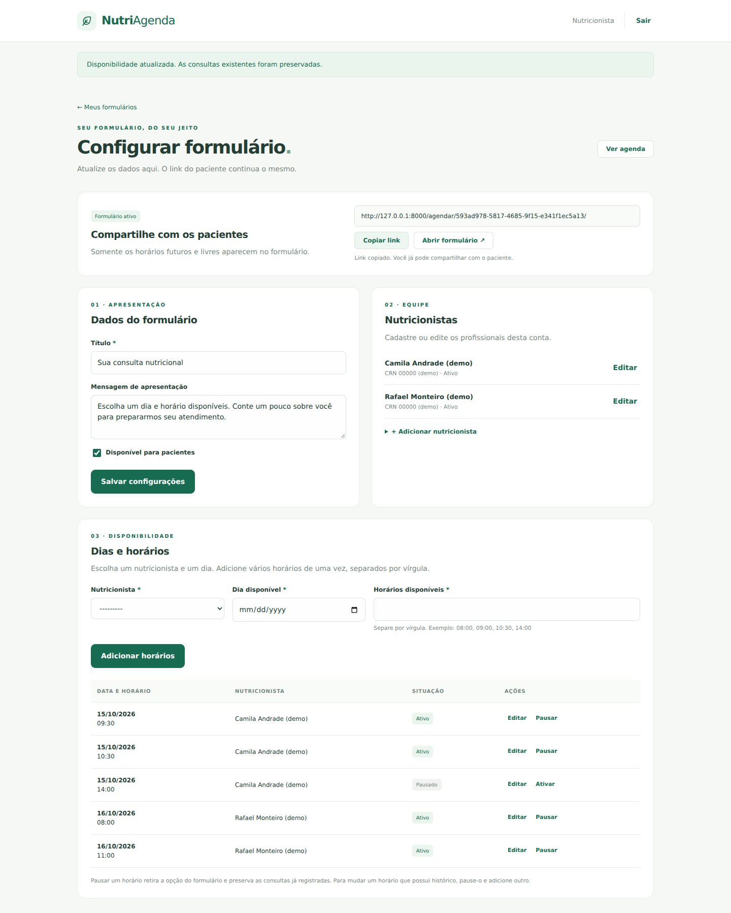
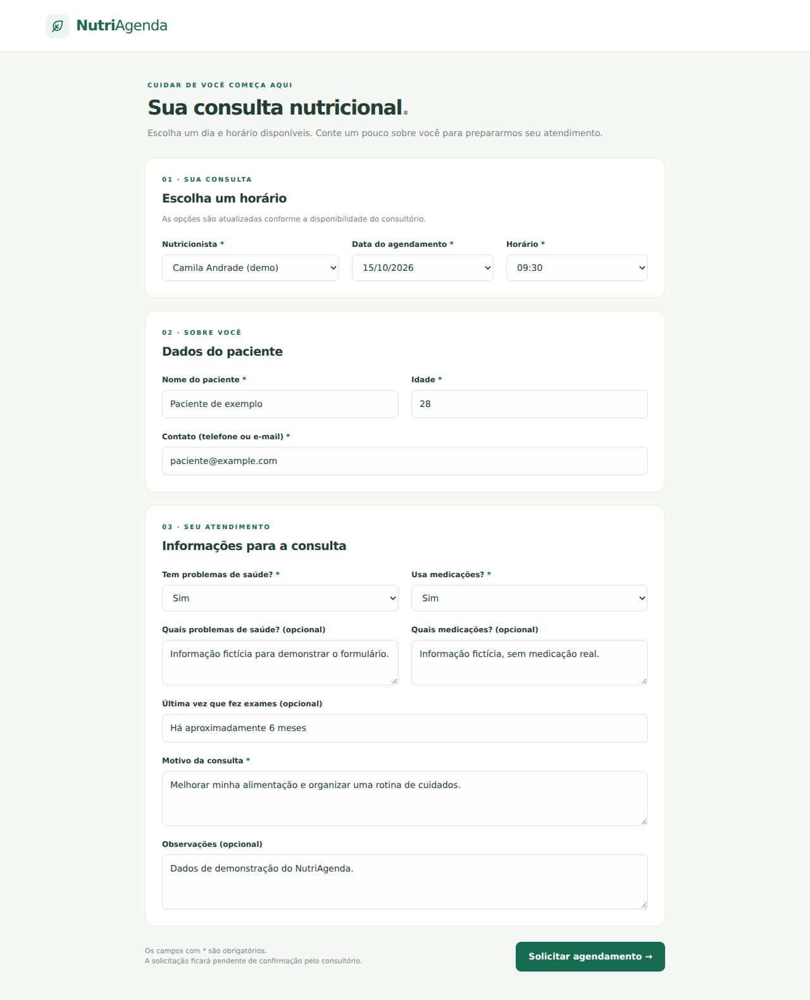
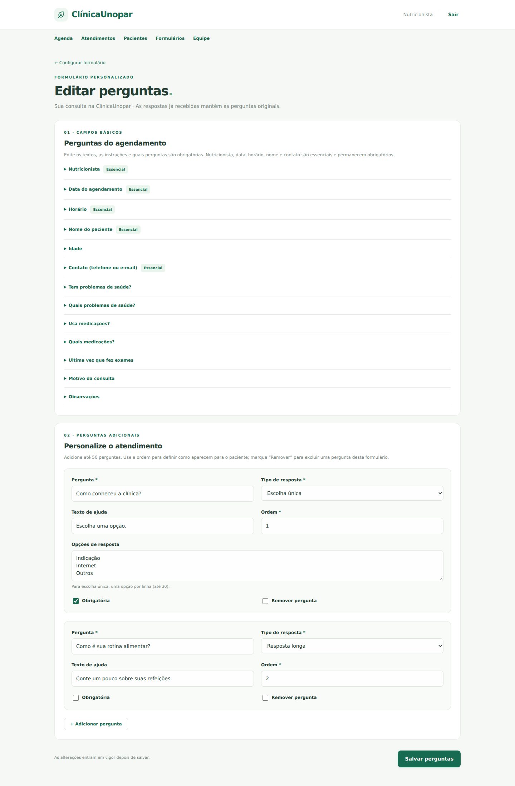
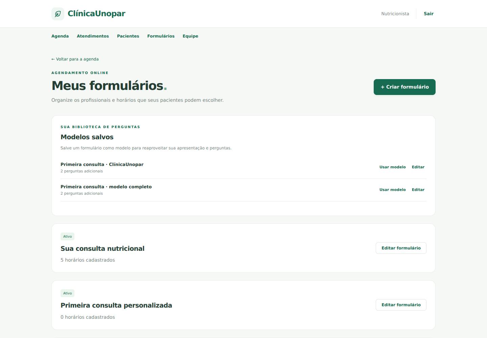
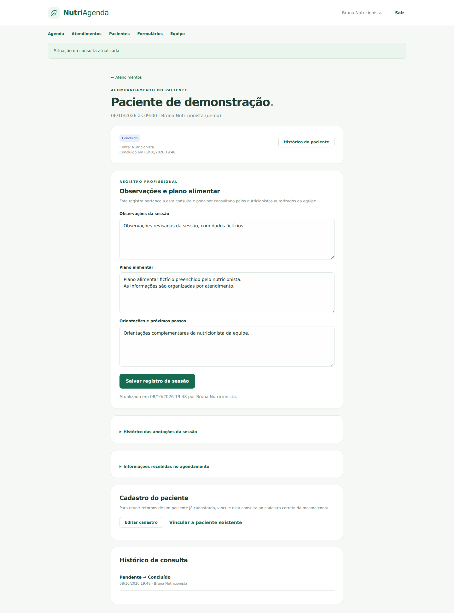
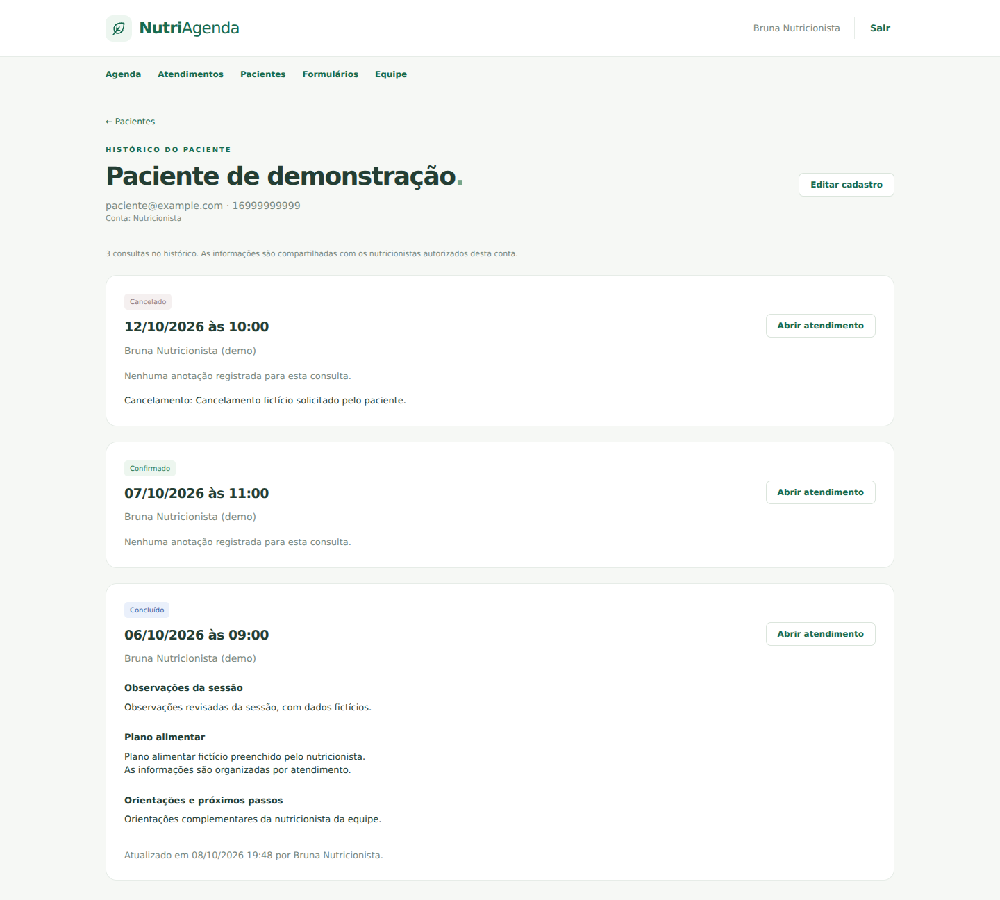
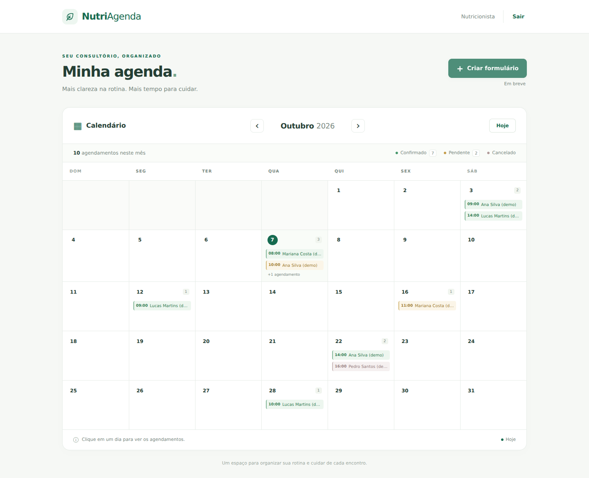

# NutriAgenda

Sistema de agendamento nutricional com **Python e Django**. A agenda mensal está integrada a formulários públicos configuráveis: os pacientes escolhem um nutricionista, uma data e um horário disponível e enviam suas informações para o consultório.

## Funcionalidades

- Calendário mensal com navegação, destaque do dia atual, horários, clientes e status.
- Popup com todas as consultas do dia e acesso às informações do paciente.
- Botão **Criar formulário** e área **Meus formulários** para configurar o agendamento, sem editar código.
- Modelos de formulário salvos por conta, reutilizáveis e editáveis. Cada novo formulário recebe uma cópia independente das perguntas.
- Editor de campos básicos e até 50 perguntas adicionais, com tipos de resposta, ajuda, ordem e obrigatoriedade.
- Histórico das perguntas e respostas preservado após renomear ou remover campos.
- Formulários com título, mensagem de apresentação e link público fixo. É possível pausar e reativar cada formulário.
- Cadastro e edição de nutricionistas, incluindo nome, CRN e situação. Desativar um profissional retira seus horários das opções públicas.
- Cadastro de vários horários de uma vez para cada dia e profissional: `08:00, 09:00, 10:30, 14:00`.
- Edição de data, horário e profissional de disponibilidades sem histórico de reservas. Horários com histórico podem ser pausados e substituídos por novas disponibilidades, preservando as consultas anteriores.
- Opções de data e horário dependem do nutricionista selecionado. Somente horários futuros, ativos e livres aparecem ao paciente.
- Reserva com status **Pendente**, integração automática ao calendário e prevenção de duas reservas ativas no mesmo horário para o mesmo profissional.
- Controle de atendimentos: confirmar reservas, concluir sessões e cancelar com motivo opcional, mantendo um histórico de alterações com autoria.
- Catálogo pesquisável de pacientes, cadastro e edição de contatos, histórico de consultas, observações, plano alimentar e orientações por sessão.
- Histórico das versões das anotações: cada gravação preserva os registros anteriores e identifica o profissional que salvou.
- Equipes com logins próprios: todos os membros autorizados da mesma conta têm acesso ao histórico completo dos pacientes.
- Login e acesso restrito às informações clínicas; contas sem vínculo de equipe não compartilham dados.
- Interface em português, adaptada para celular e com navegação por teclado.

## Rodar localmente

Requisitos: Python 3.10 ou superior e Git.

```bash
git clone https://github.com/Guelmif/NutriAgenda.git
cd NutriAgenda
python -m venv .venv
```

Ative o ambiente virtual:

```bash
# Windows (PowerShell)
.venv\Scripts\Activate.ps1

# Windows (Prompt de Comando)
.venv\Scripts\activate.bat

# Linux / macOS
source .venv/bin/activate
```

Depois execute:

```bash
python -m pip install -r requirements.txt
python manage.py migrate
python manage.py createsuperuser
python manage.py runserver
```

Abra **http://127.0.0.1:8000/** e entre com o usuário criado. O painel administrativo está em **http://127.0.0.1:8000/admin/**.

Para atualizar uma instalação existente, mantenha o banco local e execute:

```bash
git pull origin main
python -m pip install -r requirements.txt
python manage.py migrate
```

As migrações adicionam os novos campos e tabelas sem apagar os clientes e agendamentos anteriores. Consultas antigas continuam funcionando mesmo sem nutricionista de atendimento ou ficha associados.

## Configurar o formulário

1. Na agenda, clique em **Criar formulário**. Comece com o padrão ou selecione um **Modelo salvo**. Um modelo copia a apresentação e as perguntas; título e mensagem podem ser ajustados na configuração.
2. Em **Nutricionistas**, cadastre os profissionais. O botão **Editar** permite alterar nome, CRN e situação.
3. Em **Dias e horários**, escolha o nutricionista, o dia e informe horários separados por vírgula. É possível cadastrar datas de hoje até os próximos dois anos, no limite de 2100; horários de hoje já encerrados são recusados.
4. Ajuste os horários pelos botões **Editar**, **Pausar** e **Ativar**. Repetir um horário no mesmo formulário não duplica o cadastro. Um horário do mesmo profissional não pode ser oferecido em dois formulários diferentes.
5. Copie o link mostrado no topo. Alterar os dados não muda esse link. **Disponível para pacientes** controla se o formulário pode ser acessado.
6. Em **Editar perguntas**, personalize os campos e adicione novas perguntas. Salve para atualizar o formulário público.
7. Use **Salvar como modelo**, dê um nome e reutilize-o em **Meus formulários → Modelos salvos → Usar modelo**.
8. Use **Meus formulários** para voltar à configuração posteriormente.

O paciente não precisa de login. O endereço compartilhado deve usar um domínio acessível aos pacientes; `127.0.0.1` é apenas para testes na própria máquina. Esta implementação não publica o site nem envia mensagens aos pacientes.

Os **nutricionistas cadastrados no formulário** são profissionais da conta responsável. Seu cadastro não cria um login separado. Os formulários e sua configuração pertencem à conta responsável. O catálogo, o histórico clínico e o controle de consultas também podem ser compartilhados com membros ativos da equipe.

## Campos do paciente

| Campo | Preenchimento |
| --- | --- |
| Nutricionista | Obrigatório; opções com horários livres neste formulário |
| Data do agendamento | Obrigatória; opções disponíveis para o profissional |
| Horário | Obrigatório; opções livres no dia selecionado |
| Nome do paciente | Obrigatório |
| Idade | Obrigatória; 0 a 120 anos |
| Contato | Obrigatório; telefone com DDD ou e-mail válido |
| Tem problemas de saúde? | Obrigatório; Sim ou Não |
| Quais problemas de saúde? | Opcional; aparece ao responder Sim |
| Usa medicações? | Obrigatório; Sim ou Não |
| Quais medicações? | Opcional; aparece ao responder Sim |
| Última vez que fez exames | Opcional; texto como “há seis meses”, “março de 2026” ou “não lembro” |
| Motivo da consulta | Obrigatório |
| Observações | Opcional |

A tabela descreve o formulário padrão. Em **Editar perguntas**, os rótulos e textos de ajuda de todos os campos podem ser alterados. Nutricionista, data, horário, nome e contato permanecem visíveis e obrigatórios para viabilizar o agendamento. Os outros campos básicos podem ser ocultados ou definidos como opcionais. As perguntas de detalhes de saúde e medicações só aparecem quando a resposta correspondente é **Sim**, mesmo quando configuradas como obrigatórias.

## Perguntas e modelos reutilizáveis

O editor oferece **resposta curta**, **resposta longa**, **número** (até duas casas decimais), **data**, **sim ou não** e **escolha única** (2 a 30 opções diferentes). Cada formulário aceita até 50 perguntas adicionais, com rótulo, texto de ajuda, obrigatoriedade e ordem editáveis. Marque **Remover pergunta** e salve para excluir um campo das próximas submissões. O JavaScript é necessário para adicionar novas perguntas pela interface.

Os modelos ficam persistidos no banco e pertencem à conta que os criou. Salvar um modelo copia o título, a mensagem, as configurações dos campos básicos e as perguntas adicionais. Não copia respostas de pacientes, datas ou horários: as disponibilidades são configuradas individualmente para cada formulário, usando os profissionais cadastrados na conta.

Editar um modelo afeta os próximos formulários criados a partir dele. Formulários já existentes são cópias independentes, com links próprios, e podem ser ajustados sem alterar o modelo. Para guardar uma nova variação, use **Salvar como modelo** novamente.

Cada reserva nova guarda os textos das perguntas e suas respostas no momento do envio. Renomear, ocultar ou remover perguntas não altera as fichas recebidas. Fichas da versão anterior continuam sendo exibidas. Edições concorrentes do questionário são recusadas para evitar sobrescrever alterações; um paciente que estava preenchendo durante uma mudança recebe um aviso para conferir os novos campos e enviar novamente.

Dias, horários, profissionais, título, apresentação e perguntas são editáveis pela interface, sem modificar Python ou HTML. Os esquemas de perguntas são administrados pelo editor, e ficam somente para leitura no admin.

## Reservas e informações do paciente

Ao enviar, a consulta é registrada como **Pendente** e aquele horário deixa de aparecer para outros pacientes. No calendário, abra o dia e clique em **Ver informações do paciente**. A conta responsável e os membros ativos autorizados da equipe podem abrir essa página; o endpoint público de disponibilidade não inclui nomes de pacientes nem respostas de saúde.

A conta responsável e os nutricionistas autorizados podem confirmar, concluir ou cancelar consultas pela página **Atendimentos**, sem usar o admin. Uma consulta **Cancelada** libera o horário, desde que sua disponibilidade, o nutricionista e o formulário continuem ativos e a data ainda não tenha passado. Pausar uma disponibilidade ou desativar um formulário não cancela consultas existentes.

A confirmação exibida após o envio indica que a solicitação foi registrada. Não há envio automático de e-mail ou mensagem nem confirmação automática pelo consultório.

O banco impede duas consultas ativas com o mesmo **profissional, data e horário**, inclusive quando a consulta é inserida pelo admin com um profissional definido. A reserva é transacional: um erro na gravação da ficha desfaz também o cliente e o agendamento. O serviço serializa as reservas em SQLite e utiliza bloqueio de linha em bancos que o suportam. Se o banco não puder concluir uma escrita concorrente, o formulário informa que é necessário tentar novamente.

Nesta etapa, cada horário é uma opção pontual: não há duração de consulta, detecção de sobreposição entre horários diferentes, recorrência semanal ou remarcação pelo paciente. Consultas antigas sem profissional definido não entram na regra de conflito por profissional.

## Controle de atendimentos

Abra **Atendimentos** pelo menu ou selecione um dia no calendário e use **Ver informações do paciente**. A lista permite filtrar pelo paciente, situação e nutricionista. Reservas antigas sem ficha também podem ser controladas.

- **Confirmar consulta:** muda uma reserva pendente para confirmada.
- **Concluir atendimento:** dá baixa em uma consulta pendente ou confirmada, a partir do horário agendado. Salva a data da conclusão e mantém o horário ocupado no histórico.
- **Cancelar consulta:** exibe uma página de confirmação, aceita um motivo opcional e registra a data do cancelamento. Um horário futuro, ativo e livre pode ser reservado novamente.

Consultas concluídas e canceladas são estados finais nesta etapa, sem reabertura ou remarcação. O cancelamento preserva as informações recebidas, as anotações existentes e o histórico de alterações. Notas de consultas canceladas ficam somente para leitura. Não há envio automático de mensagens ao paciente.

As alterações registram a situação anterior, a nova, o responsável e a data. Ações com uma situação desatualizada são recusadas. A situação e os dados de consultas existentes ficam somente para leitura no admin; use a interface de atendimentos para as operações transacionais.

## Catálogo e registros das sessões

Em **Pacientes**, busque por nome, e-mail ou telefone e abra **Histórico**. O cadastro exibe as consultas de todos os nutricionistas da mesma conta, com seus status e registros de sessão. Cadastros antigos aparecem automaticamente no catálogo.

Na página de cada atendimento, registre **Observações da sessão**, **Plano alimentar** e **Orientações e próximos passos**, como texto (até 10.000 caracteres por campo). Os registros podem ser preparados antes da consulta e revisados após a conclusão. Cada salvamento guarda uma versão com autor e data; o histórico das anotações pode ser expandido na página do atendimento. As respostas originais do formulário ficam separadas e são preservadas.

Se dois profissionais abrirem a mesma sessão e tentarem editar, uma gravação com versão desatualizada é recusada. O profissional deve atualizar a página, revisar a versão recebida e salvar novamente, sem sobrescrever silenciosamente as anotações do colega.

Cada envio público cria seu próprio cadastro de paciente. Não há unificação automática por nome ou contato. Para reunir um retorno no histórico de um paciente já cadastrado, abra a consulta e use **Vincular a paciente existente**. Essa ação aceita somente pacientes da mesma conta, mantém a ficha original e as anotações da sessão, e preserva o cadastro anterior. Um novo cadastro também pode ser criado pela área **Pacientes**.

## Histórico compartilhado com a equipe

Todos os nutricionistas autorizados da mesma clínica/conta podem consultar o histórico completo dos pacientes, independentemente de qual profissional realizou a consulta. Também podem registrar sessões, editar contatos e controlar o status dos atendimentos. A conta responsável gerencia quem tem acesso:

1. Crie um usuário individual para cada nutricionista em `/admin/` (ele não precisa ser membro da equipe administrativa ou superusuário para usar a interface).
2. Entre na conta responsável pela clínica e abra **Equipe**.
3. Informe o **usuário de acesso do nutricionista** e clique em **Adicionar à equipe**. O acesso é concedido aos dados clínicos dessa conta.
4. Cada profissional entra com seu próprio login. Agenda, atendimentos e pacientes incluem os dados da própria conta e das contas que foram compartilhadas com ele.
5. Use **Pausar acesso** para retirar o compartilhamento. As próximas requisições desse usuário não terão acesso aos registros da conta; anotações e autoria existentes são preservadas.

O cadastro de um nutricionista no formulário representa um profissional de atendimento e não cria um login nem concede acesso ao sistema. O vínculo de equipe precisa ser adicionado explicitamente. A configuração dos formulários e a gestão dos membros continuam restritas à conta responsável. Equipes não compartilham dados entre si sem um vínculo autorizado; o admin mantém as permissões próprias de administração.

## Administração e demonstração

O admin permite gerenciar clientes, consultas, formulários, modelos salvos, nutricionistas, disponibilidades e fichas, além de consultar registros de sessão e alterações de status. As fichas novas com histórico de perguntas e respostas ficam somente para leitura, preservando o registro recebido. Superusuários podem administrar todas as contas; usuários com acesso ao admin e permissões dos modelos ficam limitados aos registros da própria conta. A configuração pela interface não exige acesso ao admin.

Para popular o calendário com os exemplos da primeira versão:

```bash
python manage.py seed_demo --usuario SEU_USUARIO
```

O comando adiciona dez consultas e quatro clientes fictícios, sem criar senhas e sem substituir registros existentes. Repeti-lo no mesmo mês não duplica os exemplos. Os exemplos usam endereços `example.com`; nenhum e-mail é enviado. Esse comando não configura formulários: siga a seção de configuração para criar seus próprios dias e horários.

## Estrutura

```text
NutriAgenda/
├── config/                       # Configurações, URLs, ASGI e WSGI
├── agenda/
│   ├── models.py                 # Clientes, profissionais, formulários, slots, consultas e fichas
│   ├── forms.py                  # Campos e validação de configuração e agendamento
│   ├── questionarios.py           # Esquema, editor e tipos de pergunta
│   ├── atendimento_views.py       # Controle de consultas, catálogo e equipe
│   ├── atendimento_services.py    # Operações clínicas transacionais
│   ├── atendimento_forms.py       # Validação de consultas e registros
│   ├── acesso.py                  # Contas compartilhadas por equipe
│   ├── services.py               # Reserva transacional
│   ├── admin.py                  # Administração e separação entre contas
│   ├── views.py                  # Calendário e API de consultas do dia
│   ├── formulario_views.py       # Configuração, formulário público e informações privadas
│   ├── migrations/
│   ├── management/commands/seed_demo.py
│   ├── templates/agenda/         # Templates Django
│   ├── static/agenda/            # CSS e JavaScript, sem dependências externas
│   ├── tests.py
│   ├── test_formularios.py
│   ├── test_questionarios.py
│   └── test_atendimentos.py
├── docs/                         # Capturas de tela com dados fictícios
├── manage.py
└── requirements.txt
```

## Imagens da interface

Todas as imagens usam dados fictícios. Os links mostrados nas capturas são locais e não representam um formulário publicado.















A versão do formulário para celular está em `docs/formulario-paciente-mobile.png`.

## Rotas principais

| Método | Rota | Uso |
| --- | --- | --- |
| GET | `/` | Calendário do mês atual |
| GET | `/?ano=2026&mes=10` | Calendário de um mês específico |
| GET | `/api/agendamentos/?data=2026-10-15` | Consultas do dia para o popup; requer login |
| GET | `/formularios/` | Lista dos formulários da conta |
| GET / POST | `/formularios/novo/` | Criar um formulário |
| GET / POST | `/formularios/<token>/editar/` | Configurar o formulário |
| GET / POST | `/formularios/<token>/perguntas/` | Editar campos e perguntas |
| GET / POST | `/formularios/<token>/salvar-modelo/` | Salvar modelo reutilizável |
| GET / POST | `/modelos/<id>/editar/` | Editar um modelo salvo |
| GET / POST | `/nutricionistas/<id>/editar/` | Editar um profissional |
| GET / POST | `/disponibilidades/<id>/editar/` | Editar um horário |
| POST | `/disponibilidades/<id>/situacao/` | Pausar ou ativar um horário |
| GET / POST | `/agendar/<token>/` | Formulário público |
| GET | `/agendar/<token>/disponibilidades/?profissional=<id>` | Datas e horários livres |
| GET / POST | `/agendamentos/<id>/` | Atendimento e registro privado da sessão |
| GET | `/atendimentos/` | Lista de consultas com filtros |
| GET / POST | `/agendamentos/<id>/situacao/<acao>/` | Revisar e confirmar alteração de situação |
| GET / POST | `/agendamentos/<id>/vincular/` | Vincular consulta a paciente existente |
| GET | `/clientes/` | Catálogo pesquisável de pacientes |
| GET / POST | `/clientes/novo/` | Cadastro de paciente |
| GET | `/clientes/<id>/` | Histórico completo do paciente |
| GET / POST | `/clientes/<id>/editar/` | Editar contato e nome |
| GET / POST | `/equipe/` | Membros e compartilhamento da conta |
| POST | `/equipe/<id>/acesso/` | Pausar ou ativar acesso de um membro |
| GET / POST | `/entrar/` | Login |
| POST | `/sair/` | Logout |
| GET / POST | `/admin/` | Administração Django |

Datas e horários correspondem ao horário local do consultório, com fuso configurado em `America/Sao_Paulo`. O JavaScript é necessário para escolher as datas e horários dependentes no formulário público. O calendário aceita meses de 1900 a 2100.

## Verificação

```bash
python manage.py check
python manage.py makemigrations --check --dry-run
python manage.py test
```

Os 69 testes cobrem calendário, autenticação, isolamento entre contas, campos e validação, opções dependentes, configuração, horários pausados, cancelamento, rollback, reserva simultânea por dois pacientes, modelos salvos, cópias independentes, perguntas dinâmicas, validação dos tipos de resposta, preservação do histórico, edições concorrentes, conclusão e cancelamento, liberação de horários, autoria e versões dos registros de sessão, catálogo, vinculação de retornos e acesso compartilhado/revogado por equipe. O fluxo também foi conferido em Chromium, incluindo as telas para celular.

## Configuração do ambiente

As variáveis são lidas do ambiente do sistema; o projeto não carrega arquivos `.env` automaticamente.

| Variável | Padrão local | Uso |
| --- | --- | --- |
| `DJANGO_DEBUG` | `true` | Defina `false` em produção |
| `DJANGO_SECRET_KEY` | Chave local em `.dev-secret-key` | Obrigatória em produção |
| `DJANGO_ALLOWED_HOSTS` | `localhost,127.0.0.1,[::1]` | Hosts separados por vírgula |

O servidor `runserver` é para desenvolvimento. Para publicar, configure HTTPS, servidor WSGI/ASGI e serviço de arquivos estáticos após `python manage.py collectstatic`. Com `DJANGO_DEBUG=false`, os cookies de sessão e CSRF exigem HTTPS. O código publicado no GitHub não inclui banco de dados, senhas, respostas de pacientes ou chaves locais.
